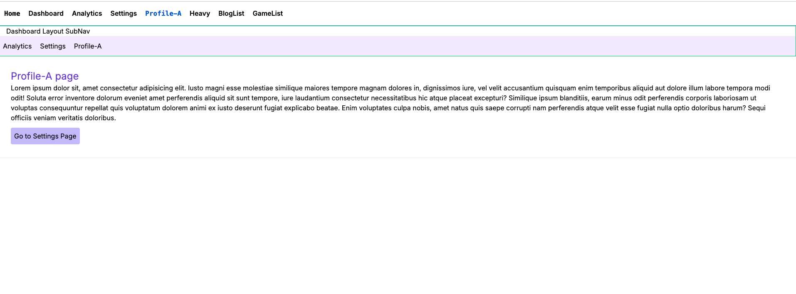

First, run the development server:

```bash
npm run dev
# or
yarn dev

```

## [Live Link:](https://nextjs-14-basic-routing.vercel.app/)


Open [http://localhost:3000](http://localhost:3000) with your browser to see the result.

- Everything inside the app folder is server components.

1. [**Project Structure**](https://nextjs.org/docs/getting-started/project-structure)

4. [**Defining Routes**](https://nextjs.org/docs/app/building-your-application/routing/defining-routes)

    - Next.js uses a **file-system based router** where **folders are used to define routes.**
  

      
    
    - A special **page.js** file is used to make route segments publicly accessible.
     

5. [**Pages and Layouts**](https://nextjs.org/docs/app/building-your-application/routing/pages-and-layouts)

    - Pages are Server Components by default
    - layout never re render . 
    - RootLayout:
     
    - Nested Layout:
     
    
6. [**Navigate and Linking**]()

    - All hooks are `Client` components

    - Programmatically go to url is possible using **usePathName hook** of next js
      this is implemented in `CustomLink Component`

    - Programmatically navigate is possible using **useRouter hook** of next js
      this is implemented in `CustomButton Component`

7. [**Loading UI and Streaming**](https://nextjs.org/docs/app/building-your-application/routing/loading-ui-and-streaming)

    -  This part use the concept of React Suspese
    
10. [**Dynamic Routes**]()

    - This part is implemented in **BlogList component**
